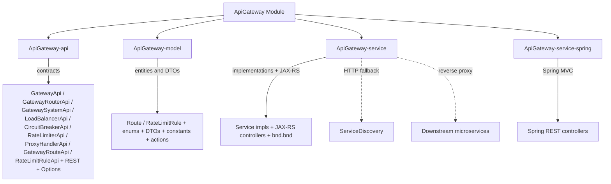
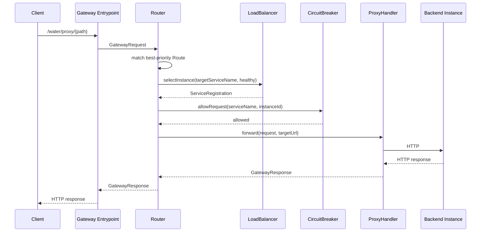

# ApiGateway Module

The **ApiGateway** module is a production HTTP API gateway for the Water Framework microservices ecosystem. It provides reverse proxying, load balancing across service instances, circuit breaking, rate limiting, and dynamic integration with `ServiceDiscovery`. The gateway sits in front of downstream microservices and routes incoming HTTP traffic based on configurable `Route` rules.

## Architecture Overview



## Sub-modules

| Sub-module | Runtime | Description |
|---|---|---|
| **ApiGateway-api** | All | Interfaces (`GatewayApi`, `GatewayRouterApi`, `GatewaySystemApi`, `LoadBalancerApi`, `CircuitBreakerApi`, `RateLimiterApi`, `ProxyHandlerApi`, `GatewayRouteApi`, `RateLimitRuleApi`), Options (`GatewaySystemOptions`), REST contracts |
| **ApiGateway-model** | All | Entities (`Route`, `RateLimitRule`), DTOs (`GatewayRequest`, `GatewayResponse`, `RouteResult`, `RateLimitResult`, `ServiceStats`), configuration (`CircuitBreakerConfig`), enums (`HttpMethod`, `LoadBalancerStrategy`, `CircuitState`, `RateLimitAlgorithm`, `RateLimitKeyType`), constants (`GatewayConstants`), actions (`ApiGatewayActions`) |
| **ApiGateway-service** | OSGi/Karaf | Service implementations, JAX-RS controllers, repositories, `GatewaySystemOptionsImpl`, `bnd.bnd` for OSGi packaging |
| **ApiGateway-service-spring** | Spring Boot | Spring MVC REST controllers (constructor-injected) |

## Route Entity

```java
@Entity
@Table(name = "gateway_route",
       uniqueConstraints = @UniqueConstraint(columnNames = {"routeId"}))
@AccessControl(...)
public class Route extends AbstractJpaEntity
    implements ProtectedEntity, OwnedResource { }
```

### Entity Fields

| Field | Type | Constraints | Description |
|---|---|---|---|
| `routeId` | String | `@NotNull`, `@NoMalitiusCode`, unique, size 1-100 | Logical route identifier |
| `pathPattern` | String | `@NotNull`, size 1-500 | Regex matched against the incoming request path |
| `method` | `HttpMethod` enum | Default `ANY` (`@PrePersist`) | `GET`, `POST`, `PUT`, `DELETE`, `PATCH`, `HEAD`, `OPTIONS`, or `ANY` |
| `targetServiceName` | String | `@NotNull`, `@NoMalitiusCode`, size 1-255 | Logical service name resolved through ServiceDiscovery |
| `rewritePath` | String | Optional, max 500 | Path rewrite applied before forwarding |
| `priority` | int | — | Higher-priority routes are matched first |
| `enabled` | boolean | Default `true` | Disables the route without deleting it |
| `predicates` | `Map<String,String>` | `@ElementCollection`, EAGER | Extension hook for match conditions (header, query, source IP, …) |
| `filters` | `Map<String,String>` | `@ElementCollection`, EAGER | Extension hook for request/response transformations |
| `ownerUserId` | Long | — | Owner user ID (hidden from the `Public` JSON view) |

## Key Services

### GatewayRouterServiceImpl
Entry point for all proxied traffic. Matches the request to the best-priority `Route`, selects a live instance via `LoadBalancer`, checks the `CircuitBreaker`, and delegates the forward to `ProxyHandler`. Regex patterns are compiled once and cached in a `ConcurrentHashMap<String, Pattern>`. Active routes are held in a `volatile` list sorted by priority descending, atomically swapped on updates.

### GatewaySystemServiceImpl
Fetches available service instances: first from the in-process Water `ServiceRegistrationApi` when present, otherwise over HTTP by calling `/water/internal/serviceregistration/available` on the remote ServiceDiscovery. Maintains the in-memory `serviceCache: Map<String, List<ServiceRegistration>>` used by the load balancer. `HttpClient` is lazily initialized via `@OnActivate`.

### LoadBalancerServiceImpl
Supports `ROUND_ROBIN` and `WEIGHTED_ROUND_ROBIN`. Each strategy keeps its own `AtomicInteger` counter per `serviceName`. Instances are filtered upstream so only `UP` instances with a non-open circuit breaker are considered.

### CircuitBreakerServiceImpl
Standard `CLOSED → OPEN → HALF_OPEN` state machine kept **per-instance** (key = `serviceName + ":" + instanceId`), so a single failing Karaf does not poison the whole logical service. Failure threshold and open timeout are configurable via `GatewaySystemOptions`.

### RateLimiterServiceImpl
Pluggable per-route rate limiting: `TokenBucket` and `FixedWindow` algorithms, selected by the `RateLimitAlgorithm` of each `RateLimitRule`. Thread-safe via `ConcurrentHashMap` counters.

### ProxyHandlerImpl
Forwards HTTP requests using JDK 11+ `java.net.http.HttpClient`. Strips hop-by-hop headers (`connection`, `keep-alive`, `transfer-encoding`, `te`, `upgrade`, `proxy-authorization`, `proxy-authenticate`, `trailers`) via `Set<String>` O(1) lookup and adds `X-Forwarded-For`, `X-Forwarded-Host`, `X-Forwarded-Proto`.

## Request Flow



## REST Endpoints

### Management API

Base path: `/water/api/gateway/`. JWT-protected. Used to configure routes, rate-limit rules, and inspect/control the gateway at runtime.

| Method | Path | Description |
|---|---|---|
| `POST` | `/water/api/gateway/routes` | Create a `Route` |
| `PUT` | `/water/api/gateway/routes` | Update a `Route` |
| `GET` | `/water/api/gateway/routes` | List routes (paginated) |
| `GET` | `/water/api/gateway/routes/{id}` | Find route by ID |
| `DELETE` | `/water/api/gateway/routes/{id}` | Delete route |
| `POST` | `/water/api/gateway/rate-limits` | Create a `RateLimitRule` |
| `PUT` | `/water/api/gateway/rate-limits` | Update a `RateLimitRule` |
| `GET` | `/water/api/gateway/rate-limits` | List rate-limit rules |
| `DELETE` | `/water/api/gateway/rate-limits/{id}` | Delete a rate-limit rule |
| `GET` | `/water/api/gateway/management/health` | Gateway health |
| `GET` | `/water/api/gateway/management/metrics` | Per-service statistics |
| `GET` | `/water/api/gateway/management/circuitBreakers` | Current circuit-breaker state per service |
| `POST` | `/water/api/gateway/management/sync` | Manually sync the instance cache from ServiceDiscovery |

### Proxy entrypoint (runtime traffic)

Base path: `/water/proxy/`. The entry point for traffic flowing **through** the gateway. The supported verbs are `GET`, `POST`, `PUT`, `DELETE`, `OPTIONS` and `HEAD`; on the Spring runtime the endpoint is `@LoggedIn`.

| Method | Path | Description |
|---|---|---|
| `GET` / `POST` / `PUT` / `DELETE` / `OPTIONS` / `HEAD` | `/water/proxy/{path:.+}` | Forwarded to the service matched by the `pathPattern` of a `Route`. Returns `404` if no route matches, `502` on proxy failure. |

> **Note**: JAX-RS `@Path` annotations in `*RestApi` interfaces must NOT include the `/water` prefix — the Water CXF server adds it automatically as the base context. A doubled `/water/water/...` would result in HTTP 404.

## Reserved Gateway Authentication

`GatewayAuthenticationApi`, `GatewayAuthenticationServiceImpl`, `AuthResult`, `AuthMethod` and `ApiKeyConfig` are intentionally kept as a reserved extension point for future gateway-specific authentication.

The current proxy route does **not** call this component: the HTTP boundary is protected by Water REST security (`@LoggedIn`). JWT validation in `GatewayAuthenticationServiceImpl` is deliberately fail-closed until it delegates to the real Water `JwtTokenService`; it must not decode unsigned JWT payloads locally.

## Default Roles

| Role | Allowed Actions |
|---|---|
| **gatewayManager** | `save`, `update`, `find`, `find_all`, `remove` + all custom actions |
| **gatewayViewer** | `find`, `find_all`, `view-metrics` |
| **gatewayOperator** | `find`, `find_all`, `update`, `view-metrics`, `proxy-request`, `refresh-routes` |

## Custom Actions

Defined in `it.water.infrastructure.apigateway.actions.ApiGatewayActions`:

| Action | String | Purpose |
|---|---|---|
| `CONFIGURE_RATE_LIMIT` | `configure-rate-limit` | Create / edit rate-limit rules |
| `MANAGE_CIRCUIT_BREAKER` | `manage-circuit-breaker` | Reset / force open a circuit |
| `VIEW_METRICS` | `view-metrics` | Read gateway runtime metrics |
| `PROXY_REQUEST` | `proxy-request` | Invoke the proxy entrypoint |
| `REFRESH_ROUTES` | `refresh-routes` | Trigger a manual route reload |

## Configuration Properties

All properties are read through the Options pattern (`GatewaySystemOptions` + `GatewaySystemOptionsImpl`). Missing values fall back to the defaults shown below.

```properties
water.discovery.url=                             # empty → rely on in-process ServiceRegistrationApi only
water.apigateway.proxy.timeout=30000             # upstream HTTP timeout (ms)
water.apigateway.circuit.breaker.failure.threshold=5
water.apigateway.circuit.breaker.timeout.ms=30000 # circuit OPEN timeout (ms)
water.apigateway.rate.limiter.default.rpm=0      # 0 = fallback rate limiter disabled
```

Keys are centralized in `it.water.infrastructure.apigateway.model.GatewayConstants`.

## Usage Example

```java
// Create a route that forwards /water/proxy/assetcategories/** to the
// 'asset-category' service with round-robin load balancing across instances.

@Inject
private GatewayRouteApi gatewayRouteApi;

Route route = new Route();
route.setRouteId("assetcategory-route");
route.setPathPattern("^/assetcategories.*");
route.setMethod(HttpMethod.ANY);
route.setTargetServiceName("asset-category");
route.setPriority(100);
route.setEnabled(true);

gatewayRouteApi.save(route);

// At runtime, GET /water/proxy/assetcategories is forwarded to
// one of the live 'asset-category' instances, rotating across them.
```

## Dual-runtime packaging

The module is built for two runtimes:

- **OSGi / Karaf** — `ApiGateway-service` is also an OSGi bundle via `bnd.bnd` (`Bundle-Activator: it.water.implementation.osgi.bundle.WaterBundleActivator`). JAX-RS controllers use `@FrameworkRestController` + `@Inject @Setter` (Water pattern).
- **Spring Boot** — `ApiGateway-service-spring` hosts Spring MVC controllers. These use `@RestController` + constructor injection. Both controller sets implement the same logical contract (`*RestApi` interface) and expose the same paths; the duplication is intentional and how Water supports both runtimes.

## Dependencies

- **Core-api** — component lifecycle, registry, `@FrameworkComponent`, `@Inject`
- **Core-permission** — `@AccessControl`, `CrudActions`, custom actions
- **Repository-entity** — `AbstractJpaEntity`, `ProtectedEntity`, `OwnedResource`
- **JpaRepository-spring** — Spring JPA persistence
- **ServiceDiscovery-api** — service instance resolution
- **Rest-spring-api** — Spring MVC REST controller base
- **Rest-api** — JAX-RS REST controller base (OSGi runtime)
- **Spring Boot** — HTTP server and DI for the Spring runtime
- **java.net.http.HttpClient** (JDK 11+) — reverse proxy HTTP client

## Testing

- Unit tests + Karate integration tests cover routing, load balancing, circuit breaker, rate limiter, and management endpoints.
- Karate runner: `ApiGatewayRestApiTest` — discovers feature files under `src/test/resources/karate/` (`route-crud.feature`, `rate-limit-rule-crud.feature`, `gateway-management.feature`, `gateway-proxy.feature`).
- `it.water.application.properties` enables `water.testMode=true` and `water.rest.security.jwt.validate=false` for the Karate runtime.
